<p align="center">
  
</p>

<h1 align="center">BuilderDex // shreyaas5</h1>

<p align="center">
  <strong>Computer Science student building AI agents, developer tools, and web experiments.</strong>
</p>

<p align="center">
  <a href="https://github.com/shreyaas5?tab=repositories">systems</a>
  ·
  <a href="https://github.com/shreyaas5?tab=stars">signals</a>
</p>

---

```txt
╔════════════════════════════════════════════════════════════════╗
║ BUILDERDEX ENTRY #0005                                        ║
╠════════════════════════════════════════════════════════════════╣
║ status        online                                          ║
║ role          computer science engineer in training            ║
║ mode          build first, decorate second                     ║
║ coordinates   agents / devtools / web experiments / CS basics  ║
╚════════════════════════════════════════════════════════════════╝
```

<table>
  <tr>
    <td width="50%">
      
    </td>
    <td width="50%">
      
    </td>
  </tr>
</table>

<p align="center">
  
</p>

## current build lanes

```txt
AI AGENTS             experiments in automation and agent workflows
DEVELOPER TOOLS       small utilities that make building less annoying
WEB EXPERIMENTS       interfaces, dashboards, and visual systems
CS FUNDAMENTALS       algorithms, structure, and systems thinking
```

## repo slots

| mission | signal | status |
|---|---|---|
| `agent-lab` | experiments with AI agents and automation | building |
| `devtools-lab` | utilities, scripts, and workflow upgrades | building |
| `web-ui-lab` | interfaces with actual polish | building |

## operating stack

<p>
  
  
  
  
  
</p>

## transmission log

```txt
> building systems that do real work
> learning by shipping projects, not collecting badges
> turning curiosity into repos with a pulse
> next objective: replace every placeholder with a real shipped repo
```

<p align="center">
  <picture>
    <source media="(prefers-color-scheme: dark)" srcset="https://raw.githubusercontent.com/shreyaas5/shreyaas5/output/github-contribution-grid-snake-dark.svg" />
    <source media="(prefers-color-scheme: light)" srcset="https://raw.githubusercontent.com/shreyaas5/shreyaas5/output/github-contribution-grid-snake.svg" />
    
  </picture>
</p>

<p align="center">
  
</p>

<p align="center">
  <sub>profile assets regenerate automatically through GitHub Actions</sub>
</p>
