<p align="center">
  
</p>

<h1 align="center">mission control // shreyaas sachdeva</h1>

<p align="center">
  <strong>Computer Science student building autonomous agents, developer tools, and space-flavored systems.</strong>
</p>

<p align="center">
  <a href="https://github.com/ShreyaasSachdeva?tab=repositories">systems</a>
  ·
  <a href="https://github.com/ShreyaasSachdeva?tab=stars">signals</a>
</p>

---

```txt
╔════════════════════════════════════════════════════════════════╗
║ SHREYAAS_OS                                                   ║
╠════════════════════════════════════════════════════════════════╣
║ status        online                                          ║
║ role          computer science engineer in training            ║
║ mission       make AI systems less annoying and more useful    ║
║ coordinates   agents / systems / space / developer tooling     ║
╚════════════════════════════════════════════════════════════════╝
```

<table>
  <tr>
    <td width="50%">
      
    </td>
    <td width="50%">
      
    </td>
  </tr>
</table>

## current trajectory

```txt
AUTONOMOUS AGENTS      ████████████████░░░░  80%
MULTI-AGENT SYSTEMS    ██████████████░░░░░░  70%
SYSTEMS THINKING       ████████████░░░░░░░░  60%
SPACE + ASTRONOMY      █████████████████░░░  85%
```

## featured missions

| mission | signal | status |
|---|---|---|
| `autonomous-multi-agent-system` | agents coordinating work with less human babysitting | in development |
| `developer-tools-lab` | small utilities that remove repetitive engineering friction | prototyping |
| `space-systems-archive` | astronomy notes, simulations, and visual experiments | exploring |

## operating stack

<p>
  
  
  
  
  
</p>

## transmission log

```txt
> building systems that do real work
> learning by shipping projects, not collecting badges
> turning curiosity into repos with a pulse
> next objective: make the profile itself a living artifact
```

<p align="center">
  <picture>
    <source media="(prefers-color-scheme: dark)" srcset="https://raw.githubusercontent.com/ShreyaasSachdeva/ShreyaasSachdeva/output/github-contribution-grid-snake-dark.svg" />
    <source media="(prefers-color-scheme: light)" srcset="https://raw.githubusercontent.com/ShreyaasSachdeva/ShreyaasSachdeva/output/github-contribution-grid-snake.svg" />
    
  </picture>
</p>

<p align="center">
  
</p>

<p align="center">
  <sub>profile assets regenerate automatically through GitHub Actions</sub>
</p>


<!--
**shreyaas5/shreyaas5** is a ✨ _special_ ✨ repository because its `README.md` (this file) appears on your GitHub profile.

Here are some ideas to get you started:

- 🔭 I’m currently working on ...
- 🌱 I’m currently learning ...
- 👯 I’m looking to collaborate on ...
- 🤔 I’m looking for help with ...
- 💬 Ask me about ...
- 📫 How to reach me: ...
- 😄 Pronouns: ...
- ⚡ Fun fact: ...
-->
